# Technical Design Document: Citizen SERA
## System for Empathetic Rights Advocacy

### 1. Executive Summary

Citizen SERA is an AI-powered civic advocacy platform that leverages agentic AI to democratize access to government services and benefits. The system employs a multi-agent AI architecture to provide personalized advocacy, automated case management, and intelligent policy interpretation for Australian citizens and residents.

### 2. System Architecture Overview

#### 2.1 High-Level Architecture

```mermaid
graph TB
    %% Client Layer
    subgraph ClientLayer["🎨 Client Layer"]
        WebFrontend[🌐 React Frontend<br/>TypeScript/PWA]
        MobileApp[📱 Mobile App<br/>React Native]
        APIClients[🔌 API Clients<br/>Gov/NGO Systems]
        AdminPanel[⚙️ Admin Panel<br/>Management Console]
    end
    
    %% CDN and Edge
    subgraph Edge["🌍 Edge Layer"]
        CDN[🚀 Content Delivery Network<br/>CloudFront/Azure CDN]
        EdgeCache[💾 Edge Caching<br/>Static Assets]
        DDoSProtect[🛡️ DDoS Protection<br/>AWS Shield/Cloudflare]
    end
    
    %% API Gateway
    subgraph Gateway["🚪 API Gateway Layer"]
        LoadBalancer[⚖️ Application Load Balancer<br/>Health Checks]
        Auth[🔐 Authentication Service<br/>JWT/OAuth2/SSO]
        RateLimit[🚦 Rate Limiting<br/>Redis-based]
        APIVersion[📋 API Versioning<br/>v1/v2 Management]
        Monitoring[📊 API Monitoring<br/>Logs/Metrics/Traces]
        CORS[🌐 CORS Handler<br/>Cross-origin Security]
    end
    
    %% Microservices Layer
    subgraph Microservices["🔧 Microservices Layer"]
        UserService[👤 User Service<br/>Profile/Auth Management]
        AgentHub[🤖 AI Agent Hub<br/>Multi-Agent Orchestration]
        PolicyEngine[📖 Policy Engine<br/>Rules/Eligibility Logic]
        CaseService[📋 Case Management<br/>Workflow Automation]
        DocumentProc[📄 Document Processor<br/>OCR/AI Analysis]
        ForumService[💬 Forum Service<br/>Community Features]
        NotifyService[📢 Notification Service<br/>Email/SMS/Push]
        AnalyticsService[📈 Analytics Service<br/>Business Intelligence]
        IntegrationService[🔗 Integration Service<br/>External APIs]
    end
    
    %% AI/ML Services
    subgraph AIServices["🧠 AI/ML Services Layer"]
        LLMOrchestrator[🎭 LLM Orchestrator<br/>GPT-4/Claude/Gemini]
        NLPPipeline[📝 NLP Pipeline<br/>Understanding/Generation]
        VectorSearch[🎯 Vector Search<br/>Semantic Similarity]
        MLModels[🔬 Custom ML Models<br/>Classification/Prediction]
        AIMonitoring[🔍 AI Monitoring<br/>Performance/Safety]
    end
    
    %% Message Queue & Communication
    subgraph Messaging["📨 Messaging Layer"]
        EventBus[🚌 Event Bus<br/>Apache Kafka]
        TaskQueue[📋 Task Queue<br/>Celery/Redis]
        PubSub[📡 Pub/Sub System<br/>Real-time Events]
        WebSockets[⚡ WebSocket Manager<br/>Live Connections]
    end
    
    %% Data Layer
    subgraph DataLayer["💾 Data Layer"]
        PostgresMain[(🐘 PostgreSQL<br/>Primary Database)]
        RedisCache[(🔴 Redis Cluster<br/>Cache/Sessions)]
        VectorDB[(🎯 Vector Database<br/>Pinecone/Weaviate)]
        DocumentStore[(📁 Document Store<br/>S3/Azure Blob)]
        SearchEngine[(🔍 Elasticsearch<br/>Full-text Search)]
        MessageQueue[(📨 Message Queue<br/>Redis/RabbitMQ)]
    end
    
    %% External Integrations
    subgraph External["🌐 External Systems"]
        GovAPIs[🏛️ Government APIs<br/>Centrelink/ATO/Medicare]
        LegalAid[⚖️ Legal Aid Systems<br/>Community Legal Centers]
        PaymentGW[💳 Payment Gateway<br/>Stripe/PayPal]
        EmailService[📧 Email Service<br/>SendGrid/SES]
        SMSService[📱 SMS Service<br/>Twilio]
        IdentityVerify[🆔 Identity Verification<br/>Veriff/Jumio]
    end
    
    %% Infrastructure Layer
    subgraph Infrastructure["☁️ Infrastructure Layer"]
        Kubernetes[⚙️ Kubernetes<br/>Container Orchestration]
        Docker[🐳 Docker<br/>Containerization]
        Monitoring[📊 Monitoring Stack<br/>Prometheus/Grafana]
        Logging[📝 Logging Stack<br/>ELK/Fluentd]
        Backup[💾 Backup Systems<br/>Automated Snapshots]
        Security[🔒 Security Tools<br/>Vault/Scanner]
    end
    
    %% Connections Flow
    ClientLayer --> Edge
    Edge --> Gateway
    Gateway --> Microservices
    Microservices --> AIServices
    Microservices --> Messaging
    Microservices --> DataLayer
    Microservices --> External
    
    %% Service Mesh Connections
    UserService -.-> Auth
    AgentHub -.-> LLMOrchestrator
    PolicyEngine -.-> VectorSearch
    CaseService -.-> TaskQueue
    DocumentProc -.-> MLModels
    ForumService -.-> EventBus
    NotifyService -.-> EmailService
    AnalyticsService -.-> SearchEngine
    IntegrationService -.-> GovAPIs
    
    %% Data Flow
    UserService --> PostgresMain
    AgentHub --> RedisCache
    PolicyEngine --> VectorDB
    DocumentProc --> DocumentStore
    ForumService --> PostgresMain
    AnalyticsService --> SearchEngine
    
    %% Infrastructure Connections
    Microservices --> Kubernetes
    AIServices --> Docker
    DataLayer --> Monitoring
    External --> Security
    
    style ClientLayer fill:#e3f2fd
    style Edge fill:#f1f8e9
    style Gateway fill:#f3e5f5
    style Microservices fill:#fff3e0
    style AIServices fill:#fce4ec
    style Messaging fill:#e8f5e8
    style DataLayer fill:#e0f2f1
    style External fill:#fff8e1
    style Infrastructure fill:#fafafa
```



```
┌─────────────────────────────────────────────────────────────┐
│                    Client Layer                             │
├─────────────────────────────────────────────────────────────┤
│  React Frontend  │  Mobile App    │  API Clients           │
│  (TypeScript)    │  (React Native)│  (Government/NGO)      │
└─────────────────────────────────────────────────────────────┘
                              │
                              ▼
┌─────────────────────────────────────────────────────────────┐
│                   API Gateway                               │
├─────────────────────────────────────────────────────────────┤
│  Authentication  │  Rate Limiting │  Load Balancing        │
│  Request Routing │  Monitoring    │  API Versioning        │
└─────────────────────────────────────────────────────────────┘
                              │
                              ▼
┌─────────────────────────────────────────────────────────────┐
│                 Microservices Layer                         │
├─────────────────────────────────────────────────────────────┤
│  User Service    │  AI Agent Hub  │  Policy Engine         │
│  Case Service    │  Document Proc │  Notification Service  │
│  Forum Service   │  Analytics     │  Integration Service   │
└─────────────────────────────────────────────────────────────┘
                              │
                              ▼
┌─────────────────────────────────────────────────────────────┐
│                   Data Layer                                │
├─────────────────────────────────────────────────────────────┤
│  PostgreSQL      │  Redis Cache   │  Document Store        │
│  Vector Database │  Message Queue │  Policy Knowledge Base │
└─────────────────────────────────────────────────────────────┘
```

#### 2.2 Core Components

**Frontend Application (React 19 + TypeScript)**
- Progressive Web App with offline capabilities
- Responsive design optimized for mobile and desktop
- Real-time chat interface with AI agents
- Interactive civic education modules
- Community engagement features

**AI Agent Hub**
- Multi-agent orchestration system
- Specialized agent personas for different domains
- Natural language understanding and generation
- Decision tree execution for case routing
- Learning and adaptation capabilities

**Policy Engine**
- Real-time policy interpretation
- Eligibility matching algorithms
- Automated form generation
- Compliance checking and validation
- Integration with government databases

### 3. Agentic AI Architecture

#### 3.1 Agent Ecosystem

**Primary Agent Types:**

1. **Advocacy Agent**: Main interface for user interactions
   - Natural conversation handling
   - Case intake and assessment
   - Emotional intelligence and empathy modeling
   - Multi-language support

2. **Policy Analyst Agent**: Specialized in policy interpretation
   - Policy document parsing and understanding
   - Eligibility criteria extraction
   - Deadline and requirement tracking
   - Regulatory change monitoring

3. **Document Processor Agent**: Handles form completion and submissions
   - Automated form filling
   - Document validation and verification
   - Government portal integration
   - Status tracking and updates

4. **Appeal Specialist Agent**: Manages appeal and escalation processes
   - Appeal case assessment
   - Legal argument construction
   - Evidence collection and organization
   - Success probability calculation

5. **Community Moderator Agent**: Manages forum and community features
   - Content moderation
   - Topic categorization
   - Spam detection
   - Community health monitoring

#### 3.2 Agent Communication Protocol

```typescript
interface AgentMessage {
  id: string;
  fromAgent: string;
  toAgent: string;
  messageType: 'query' | 'response' | 'task' | 'status';
  payload: any;
  priority: 'low' | 'medium' | 'high' | 'urgent';
  timestamp: string;
  correlationId: string;
}

interface AgentContext {
  userId: string;
  caseId?: string;
  sessionId: string;
  userProfile: UserProfile;
  conversationHistory: ConversationTurn[];
  activeGoals: Goal[];
}
```

#### 3.3 Knowledge Integration

**Knowledge Graph Structure:**
- Policy nodes with relationships to benefits and eligibility criteria
- User profile attributes mapped to policy requirements
- Historical case outcomes for pattern recognition
- Government agency relationships and processes

### 4. Data Architecture

#### 4.1 Database Design

**User Management:**
```sql
CREATE TABLE users (
  id UUID PRIMARY KEY,
  email VARCHAR(255) UNIQUE NOT NULL,
  profile JSONB NOT NULL,
  subscription_tier VARCHAR(50),
  created_at TIMESTAMP DEFAULT NOW(),
  updated_at TIMESTAMP DEFAULT NOW()
);

CREATE TABLE user_sessions (
  id UUID PRIMARY KEY,
  user_id UUID REFERENCES users(id),
  agent_context JSONB,
  created_at TIMESTAMP DEFAULT NOW(),
  expires_at TIMESTAMP
);
```

**Case Management:**
```sql
CREATE TABLE cases (
  id UUID PRIMARY KEY,
  user_id UUID REFERENCES users(id),
  title VARCHAR(500),
  category VARCHAR(100),
  status VARCHAR(50),
  ai_analysis JSONB,
  timeline JSONB,
  documents JSONB,
  created_at TIMESTAMP DEFAULT NOW()
);

CREATE TABLE case_interactions (
  id UUID PRIMARY KEY,
  case_id UUID REFERENCES cases(id),
  agent_id VARCHAR(100),
  interaction_type VARCHAR(50),
  content JSONB,
  created_at TIMESTAMP DEFAULT NOW()
);
```

**Policy Knowledge Base:**
```sql
CREATE TABLE policies (
  id UUID PRIMARY KEY,
  title VARCHAR(500),
  description TEXT,
  category VARCHAR(100),
  eligibility_criteria JSONB,
  requirements JSONB,
  deadlines JSONB,
  embedding VECTOR(1536),
  last_updated TIMESTAMP
);

CREATE TABLE entitlements (
  id UUID PRIMARY KEY,
  policy_id UUID REFERENCES policies(id),
  name VARCHAR(300),
  description TEXT,
  estimated_value DECIMAL,
  processing_time VARCHAR(100),
  eligibility_rules JSONB
);
```

#### 4.2 Caching Strategy

**Redis Cache Layers:**
- User session data (TTL: 24 hours)
- Policy lookup results (TTL: 6 hours)
- AI model responses (TTL: 1 hour)
- Government API responses (TTL: 30 minutes)

### 5. Security Architecture

#### 5.1 Authentication & Authorization

**Multi-Factor Authentication:**
- OAuth 2.0 with social login providers
- SMS/Email verification for sensitive operations
- Biometric authentication for mobile apps
- Hardware security keys for enterprise users

**Role-Based Access Control:**
```typescript
enum UserRole {
  CITIZEN = 'citizen',
  CASE_WORKER = 'case_worker',
  LEGAL_AID = 'legal_aid',
  ADMIN = 'admin',
  SYSTEM = 'system'
}

interface Permission {
  resource: string;
  action: 'read' | 'write' | 'delete' | 'admin';
  conditions?: Record<string, any>;
}
```

#### 5.2 Data Protection

**Encryption:**
- End-to-end encryption for sensitive communications
- AES-256 encryption for data at rest
- TLS 1.3 for data in transit
- Key rotation every 90 days

**Privacy Controls:**
- Granular consent management
- Data minimization principles
- Right to be forgotten implementation
- Audit logging for all data access

### 6. AI/ML Infrastructure

#### 6.1 Model Architecture

**Large Language Models:**
- Primary: OpenAI GPT-4 for complex reasoning
- Secondary: Anthropic Claude for safety-critical decisions
- Fallback: Open-source models for cost optimization

**Specialized Models:**
- Document classification: Fine-tuned BERT
- Sentiment analysis: Custom transformer
- Eligibility matching: Graph neural networks
- Risk assessment: Gradient boosting

#### 6.2 AI Safety & Reliability

**Safety Measures:**
- Content filtering and moderation
- Bias detection and mitigation
- Explanation generation for all AI decisions
- Human oversight for critical operations
- Continuous monitoring and alerting

**Quality Assurance:**
- A/B testing for model improvements
- Performance monitoring and degradation detection
- Feedback loops for continuous learning
- Expert validation for policy interpretations

### 7. Integration Architecture

#### 7.1 Government API Integration

**Supported Integrations:**
- Centrelink (Services Australia)
- Australian Taxation Office (ATO)
- Department of Home Affairs
- Medicare
- State government portals
- Local council systems

**Integration Patterns:**
```typescript
interface GovernmentAPIAdapter {
  authenticate(): Promise<AuthToken>;
  submitApplication(data: ApplicationData): Promise<SubmissionResult>;
  checkStatus(referenceId: string): Promise<StatusResult>;
  downloadDocuments(caseId: string): Promise<Document[]>;
}
```

#### 7.2 Third-Party Services

**External Services:**
- Identity verification (Veriff, Jumio)
- Payment processing (Stripe, PayPal)
- Communication (Twilio, SendGrid)
- Analytics (Amplitude, Mixpanel)
- Monitoring (Datadog, New Relic)

### 8. Scalability & Performance

#### 8.1 Horizontal Scaling

**Microservices Scaling:**
- Auto-scaling based on CPU/memory usage
- Queue-based workload distribution
- Database read replicas
- CDN for static content delivery

**Performance Targets:**
- API response time: <200ms (95th percentile)
- AI agent response: <3 seconds
- Page load time: <2 seconds
- Uptime: 99.9% SLA

#### 8.2 Monitoring & Observability

**Key Metrics:**
- User engagement and retention
- AI agent accuracy and satisfaction
- Case resolution time and success rate
- System performance and reliability
- Security incidents and response time

### 9. Deployment Architecture

#### 9.1 Cloud Infrastructure

**Primary: AWS**
- EKS for container orchestration
- RDS for PostgreSQL
- ElastiCache for Redis
- S3 for document storage
- CloudFront for CDN

**Alternative: Azure**
- AKS for Kubernetes
- Azure Database for PostgreSQL
- Azure Cache for Redis
- Blob Storage
- Azure CDN

#### 9.2 CI/CD Pipeline

**Development Workflow:**
1. Feature branch development
2. Automated testing (unit, integration, e2e)
3. Security scanning and compliance checks
4. Staging deployment and validation
5. Production deployment with blue-green strategy
6. Post-deployment monitoring and rollback capability

### 10. Compliance & Regulatory

#### 10.1 Privacy Compliance

**Australian Privacy Principles (APPs):**
- Transparent data collection practices
- User consent management
- Data security safeguards
- Individual access rights
- Cross-border transfer restrictions

**International Standards:**
- GDPR compliance for EU users
- ISO 27001 for information security
- SOC 2 Type II certification
- Regular penetration testing

#### 10.2 Industry Standards

**Government Integration:**
- AUSTRAC compliance for financial data
- Digital Transformation Agency guidelines
- Accessibility standards (WCAG 2.1 AA)
- Government API security standards

### 11. Future Roadmap

#### 11.1 Phase 2 Enhancements
- Voice interface integration
- Mobile app development
- Advanced analytics dashboard
- Predictive case outcome modeling

#### 11.2 Phase 3 Expansion
- Integration with legal aid organizations
- Multi-jurisdiction support (NZ, UK, Canada)
- B2B enterprise solutions
- AI-powered policy impact analysis

### 12. Risk Assessment

#### 12.1 Technical Risks
- AI model bias and fairness
- Data privacy breaches
- System availability during peak loads
- Government API changes and deprecations

#### 12.2 Mitigation Strategies
- Comprehensive testing and validation
- Disaster recovery and backup systems
- Vendor diversification and contingency planning
- Continuous security monitoring and updates